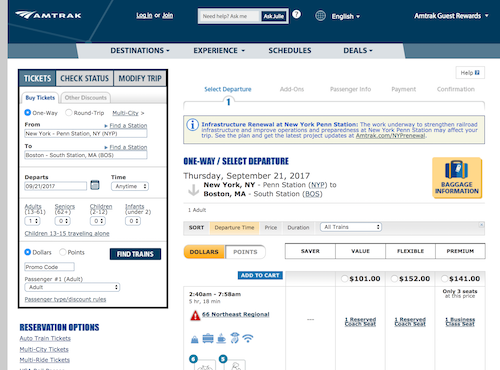

## Components

The basic unit you'll be working with in ReactJS is a **component**. Components are pieces of our application that we can define once and reuse all over the place.

For an intro to components, watch [this video](https://generalassembly.wistia.com/medias/h64z7lp1ir) (note: right click to open in a new tab!).

If you're used to writing out all of a page's view in a single HTML file, using components is a very different way of approaching web development.

With components, there is more integration and less separation of HTML, CSS, and JavaScript.
- Instead of creating a few large files, you will organize your web app into small, reusable components that encompass their own content, presentation, and behavior.

When using React, building components will be your main front-end task.
- Because they're so encapsulated, components make it easy to reuse your code, test, and separate concerns.

### Identifying Components

Take a look at [CraigsList](https://boston.craigslist.org/search/aap) (note: right click to open in a new tab!).

Each listing is a component. How can you identify this?
- Listings look identical in structure, but have different information populating them
- Listings are dynamically generated based on the user's search

Now, go to [Amtrak.com](https://www.amtrak.com/home) (note: right click to open in a new tab!). We want to look at the listing page, so put in any "From" (for example, New York - Penn Station), any "To" (for example, Boston - South Station), and pick any date. Hit "Find Trains". Now look at the listing page:

Scrolling down it, identify the visual "components" the website is comprised of. We suggest drawing this out on paper! So something like this...

As you're drawing this out, think about the following questions...

* Where do you see "nested components;" that is, where are there components inside another component? Where do you see just one "layer" instead?
* Are there any components that share the same structure?
* For components that share the same structure, what is different about them?

### So -
What does a component look like? Let's start with a simple "Hello World" example...
